# Module OpenAPI Kotlin Typed

`typed` turns parsed OpenAPI schemas into a typed intermediate model (`Model`) that the JVM renderer later turns into Kotlin declarations and route APIs.

The important distinction is:

- `typed` decides the semantic shape: primitive, object, enum, union, discriminated hierarchy, wrapper type, route overload, and so on.
- `renderer` decides the final Kotlin syntax for that shape.

This README documents the current decision tree in `typed`, so it matches the code instead of an aspirational feature list.

## Decision Tree

```mermaid
flowchart TD
    A["ReferenceOr&lt;Schema&gt;"] --> B["Resolve as Value / Reference / Recursive"]
    B --> C{"Recursive or nested $ref?"}
    C -->|yes| R["Model.Reference\nUse named Kotlin type"]
    C -->|no| D{"Top-level ref with discriminator mapping\nand object properties?"}
    D -->|yes| DO["Model.DiscriminatedObject\nSealed hierarchy with base + subtypes"]
    D -->|no| E{"schema.type present?"}

    E -->|type is array of basic types| TA["Treat as union\nDrop `null` branch into `nullable = true`"]
    TA --> U1["Model.OneOf"]

    E -->|"object + properties"| O["Model.Object"]
    E -->|"object without properties"| OP{"additionalProperties?"}
    OP -->|"schema-valued"| APS["Inline: Model.Collection\nTop-level ref: object wrapper with `values`"]
    OP -->|"false"| APF["Inline: Model.Primitive.Unit\nTop-level ref: empty Model.Object"]
    OP -->|"true or absent"| APJ["Inline: Model.FreeFormJson\nTop-level ref: wrapper object"]

    E -->|array| COL{"Top-level ref?"}
    COL -->|no| C1["Model.Collection"]
    COL -->|yes| C2["Object wrapper with required `items: List&lt;...&gt;`"]

    E -->|"string/number/integer/boolean + enum"| EN["Model.Enum wrapping inner primitive"]
    E -->|"string/number/integer/boolean"| PR{"format?"}
    PR -->|"string + binary"| PBA["Model.ByteArray"]
    PR -->|"string + uuid"| PUUID["Model.Uuid"]
    PR -->|"string + date"| PDATE["Model.Date"]
    PR -->|"string + date-time"| PDATETIME["Model.DateTime"]
    PR -->|"string + other/none"| PSTRING["Model.Primitive.String"]
    PR -->|"integer + int32"| PINT["Model.Primitive.Int"]
    PR -->|"integer + other/none"| PLONG["Model.Primitive.Long"]
    PR -->|"number + float"| PFLOAT["Model.Primitive.Float"]
    PR -->|"number + other/none"| PDOUBLE["Model.Primitive.Double"]
    PR -->|boolean| PBOOL["Model.Primitive.Boolean"]

    E -->|null| ERR["Error: null must already be folded into nullable"]

    E -->|"no type, but enum"| EN2["Model.Enum"]
    E -->|"allOf"| AOF{"Nullable sentinel only?"}
    AOF -->|yes, one real branch| AOF1["Render branch and set `isNullable = true`"]
    AOF -->|yes, multiple real branches| AOF2["Merge with `allOf(...)` and set `isNullable = true`"]
    AOF -->|no| AOF3["Merge with `allOf(...)`"]

    E -->|"oneOf"| OOF{"Nullable sentinel only?"}
    OOF -->|yes, one real branch| OOF1["Render branch and set `isNullable = true`"]
    OOF -->|otherwise multi-branch| OOF2["Model.OneOf"]
    OOF -->|single branch| OOF3["Collapse to branch"]

    E -->|"anyOf"| AYF{"Nullable sentinel only?"}
    AYF -->|yes, one real branch| AYF1["Render branch and set `isNullable = true`"]
    AYF -->|otherwise multi-branch| AYF2["Model.AnyOf"]
    AYF -->|single branch| AYF3["Collapse to branch"]

    E -->|"properties without type"| O2["Model.Object"]
    E -->|"additionalProperties without type"| OP
    E -->|"items without type"| C1
    E -->|fallback| F["Model.FreeFormJson\nTop-level ref becomes wrapper object"]
```

## Primitive Mapping

| OpenAPI shape | Typed model | Typical Kotlin surface |
| --- | --- | --- |
| `type: string` | `Model.Primitive.String` | `String` |
| `type: string, format: binary` | `Model.ByteArray` | `ByteArray` |
| `type: string, format: uuid` | `Model.Uuid` | `Uuid`-like type |
| `type: string, format: date` | `Model.Date` | date type |
| `type: string, format: date-time` | `Model.DateTime` | date-time type |
| `type: integer, format: int32` | `Model.Primitive.Int` | `Int` |
| `type: integer` or `format: int64` | `Model.Primitive.Long` | `Long` |
| `type: number, format: float` | `Model.Primitive.Float` | `Float` |
| `type: number` or `format: double` | `Model.Primitive.Double` | `Double` |
| `type: boolean` | `Model.Primitive.Boolean` | `Boolean` |
| primitive + `enum` | `Model.Enum(inner = primitive)` | enum / sealed enum wrapper |

Notes:

- `nullable` is stored separately on every `Model`.
- Primitive defaults are parsed and typed.
- String defaults stay strings unless the format maps to a dedicated type.

## Object And Collection Rules

### Plain objects

- `type: object` with `properties` becomes `Model.Object`.
- `required` stays attached per property as `Model.Object.Property`.
- `readOnly` and `writeOnly` filtering happens before object creation, based on `SchemaContext.Read` or `SchemaContext.Write`.
- `hadPropertiesBeforeStripping` is set when read/write filtering removed fields from a schema that originally had them.

### `additionalProperties`

- Inline object with only `additionalProperties: { ... }` becomes `Model.Collection(inner)` in the plain schema transformer.
- Top-level referenced object with only `additionalProperties: { ... }` becomes a named wrapper object with a required `values` property.
- Inline object with `additionalProperties: true` or no structural hints falls back to `Model.FreeFormJson`.
- Inline object with `additionalProperties: false` and no properties becomes `Model.Primitive.Unit`.
- Top-level referenced object with `additionalProperties: false` becomes an empty named `Model.Object`.

### Arrays

- Inline arrays become `Model.Collection(inner)`.
- Top-level referenced arrays become named wrapper objects with one required `items` property of type `List<...>`.
- Nested inline objects, enums, and unions inside referenced arrays get nested naming contexts so the renderer can emit stable Kotlin names.

## References, Wrappers, And Naming

- Nested `$ref`s usually stay as `Model.Reference` so the renderer can reuse the named Kotlin type instead of inlining it.
  Discriminated `oneOf` / `anyOf` cases are the main exception: referenced cases are normalized under the union-case context so the renderer can emit shallow nested cases instead of wrapper refs.
- Recursive references always become `Model.Reference`.
- Top-level references to primitives are intentionally wrapped as `Model.Object.value(...)` with `isScalarWrapper = true`.
  This preserves a named Kotlin type for schemas like `UserId`, even though the underlying value is scalar.
- Top-level references to arrays are also wrapped, but with an `items` property instead of `value`.
- `NamingContext` determines whether a generated Kotlin type is top-level, nested under an object property, nested under a union case, or attached to a route body/parameter.

## Union And Discriminator Rules

### `oneOf` and `anyOf`

- Multi-branch `oneOf` becomes `Model.OneOf`.
- Multi-branch `anyOf` becomes `Model.AnyOf`.
- A single branch collapses to that branch.
- If one branch is OpenAPI `null` (or the internal nullable sentinel), `typed` drops that branch and sets `isNullable = true` on the resulting model.
- Non-discriminated union cases keep the existing naming heuristics based on special `type` / `event` enums, referenced schema names, or primitive/object structure.
- Discriminated union case literals are resolved in this order: explicit discriminator mapping key, single-value discriminator field on the subtype, schema-name fallback for referenced cases.
- Discriminated referenced cases are inlined under the union-case context instead of staying as `Model.Reference`.
- When a discriminated case has a tag-only discriminator property, `typed` strips it from the case payload before rendering.
- If stripping leaves exactly one required closed object property, `typed` hoists that object's direct fields into the case payload.

### Discriminated object hierarchies

- This is separate from plain unions.
- A top-level referenced object with `properties`, a discriminator, and explicit discriminator mapping is rendered as `Model.DiscriminatedObject`.
- Each subtype is resolved from an `allOf` chain.
- Shared base properties become `abstractProperties`.
- The base schema also gets a concrete "self" case when the discriminator maps the base schema to one of its own discriminator values.

## Route-Level Rendering Decisions

The route layer adds a few Kotlin-facing decisions on top of plain schema transformation:

- Path parameters using finite closed enums are expanded into concrete routes with fixed path segments.
- Path parameter unions are upgraded to `PathSegment.OverloadedParameter` when every case is a flattenable scalar/date/enum shape.
- Inline non-discriminated request-body unions become `Route.Body.OverloadedBody`, which is the signal for overload-style Kotlin APIs.
- `application/x-www-form-urlencoded` bodies are only considered supported when every field is scalar-safe or has explicit encoding metadata.

## Current Limits

These are current implementation limits, not desired end-state behavior:

- Discriminated object hierarchies currently require explicit discriminator mappings.
- Several `allOf` merge combinations are still unimplemented, especially unions and enums.
- Free-form JSON defaults are not modeled yet.
- Collection defaults are kept as raw string payloads rather than item-typed defaults.

## Immediate Review Findings

These are the concrete findings from the current review pass that should be addressed before relying on the module as the authoritative rendering contract.

### 1. `allOf` still hard-fails for valid composite shapes

- File: `typed/src/commonMain/kotlin/io/github/nomisrev/openapi/transformers/AllOf.kt`
- Current behavior: model merging still reaches `TODO(...)` / `error(...)` for legal combinations such as union-with-union, enum-with-enum, and free-form-json with union.
- Effect: valid OpenAPI specs can fail during model generation instead of degrading into a supported representation or surfacing a typed limitation cleanly.

### 2. `allOf` object merging can silently drop `additionalProperties`

- File: `typed/src/commonMain/kotlin/io/github/nomisrev/openapi/transformers/DiscriminatedObject.kt`
- Current behavior: `Schema.mergeObject(...)` uses `additionalProperties?.merge(other.additionalProperties)`, so if the left branch has no `additionalProperties` and the right branch introduces it, the right-hand side is discarded.
- Effect: merged objects can become stricter than the source spec, especially for schemas that combine fixed properties with a typed map tail.

### 3. Discriminated object hierarchies require explicit discriminator mappings

- Files:
  - `typed/src/commonMain/kotlin/io/github/nomisrev/openapi/registry/Predicates.kt`
  - `typed/src/commonMain/kotlin/io/github/nomisrev/openapi/transformers/DiscriminatedObject.kt`
- Current behavior: inheritance-style discriminated objects are only recognized when `discriminator.mapping` is present and non-empty.
- Effect: valid OpenAPI hierarchies that rely on implicit schema-name mapping do not render as `Model.DiscriminatedObject`, even though plain unions already support implicit discriminator values.

### 4. Closed enums conflate the string `"null"` with actual null

- File: `typed/src/commonMain/kotlin/io/github/nomisrev/openapi/transformers/Enum.kt`
- Current behavior: enum handling treats any member or default equal to `"null"` case-insensitively as the nullable/null branch.
- Effect: a literal string enum member `"null"` becomes indistinguishable from an actual null enum case, which changes both membership and default semantics.
